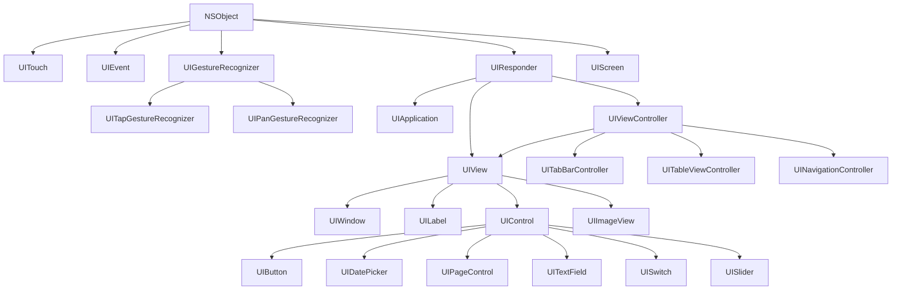

# 내 소개 어플리케이션

## 인터페이스 빌더로 레이아웃 구성하기

 

## Auto Layout

## UIKit과 개발자 문서
- `User Interface Kit`
- `iOS` 또는 `tvOS`의 사용자 인터페이스 구성을 위한 `프레임워크`
- `Foundation` 프레임워크와 더불어 iOS의 대부분의 큰 기능을 이루는 뼈대
    - `UIKit` 프레임워크를 import 했다면 `Foundation` 프레임워크는 import할 필요 `없음`

- 도식도
